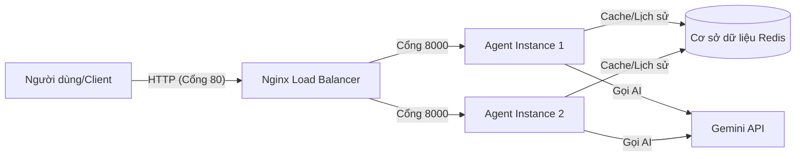

# Code Lab: Deploy Your AI Agent to Production

---

## Part 1: Localhost vs Production

### Exercise 1.1: Phát hiện anti-patterns

1. **Hardcoded Secrets**: API Key (`API_KEY = "12345"`) được viết trực tiếp trong mã nguồn.
2. **Cố định Port**: `port=8000` bị ghi chết, gây khó khăn khi chạy trên các nền tảng đám mây yêu cầu gán cổng linh hoạt (dynamic port).
3. **Chế độ Debug được bật**: `debug=True` đang hoạt động, có thể làm lộ thông tin hệ thống và dấu vết lỗi (stack traces) khi chạy thực tế.
4. **Thiếu Health Checks**: Không có các endpoint `/health` hoặc `/ready` để hạ tầng giám sát trạng thái ứng dụng.
5. **Dùng lệnh Print**: Sử dụng `print()` thay vì logging chuyên nghiệp khiến việc quản lý và phân tích log ở quy mô lớn trở nên bất khả thi.

### Exercise 1.3: So sánh với advanced version

| Tính năng        | Phát triển (Cơ bản) | Production (Nâng cao)           | Tại sao quan trọng?                                                                              |
| ---------------- | ------------------- | ------------------------------- | ------------------------------------------------------------------------------------------------ |
| **Cấu hình**     | Hardcoded           | Biến môi trường (.env)          | Ngăn chặn rò rỉ bí mật và giúp triển khai linh hoạt hơn.                                         |
| **Health Check** | Không có            | Endpoint `/health` & `/ready`   | Cho phép nền tảng giám sát và tự động khởi động lại khi gặp lỗi.                                 |
| **Logging**      | `print()`           | Logging cấu trúc JSON           | Cho phép phân tích log tự động, tìm kiếm và thiết lập cảnh báo dễ dàng.                          |
| **Shutdown**     | Tắt đột ngột (Kill) | Tắt an toàn (Graceful shutdown) | Đảm bảo các yêu cầu đang xử lý được hoàn tất và đóng các kết nối đúng cách để tránh mất dữ liệu. |

---

## Part 2: Docker Containerization

### Exercise 2.1: Dockerfile cơ bản

1. **Base Image**: `python:3.11-slim` (production). Đây là môi trường Python nhẹ, chỉ chứa các thư viện thiết yếu, giúp tối ưu dung lượng.
2. **Thư mục làm việc (Working Directory)**: `/app`. Giúp cô lập mã nguồn ứng dụng khỏi các phần còn lại của hệ điều hành trong container.
3. **Thứ tự Copy**: Tại sao phải `COPY requirements.txt` trước? Để tận dụng **Docker Layer Caching**. Nếu mã nguồn thay đổi nhưng danh sách thư viện không đổi, Docker sẽ bỏ qua bước cài đặt (`pip install`) tốn thời gian.
4. **CMD vs ENTRYPOINT**: `ENTRYPOINT` định nghĩa lệnh luôn luôn chạy khi khởi động (ví dụ: `python`), trong khi `CMD` cung cấp các tham số mặc định (ví dụ: `app/main.py`) có thể bị ghi đè khi chạy lệnh Docker.

### Exercise 2.3: Multi-stage build

- **Tầng 1 (Build)**: Cài đặt các công cụ xây dựng, trình biên dịch và tải các thư viện cần thiết vào một môi trường ảo hoặc cache.
- **Tầng 2 (Run)**: Chỉ copy mã nguồn ứng dụng cuối cùng và các thư viện đã cài đặt từ Tầng 1 sang một Image mới hoàn toàn sạch sẽ.
- **Kết quả**: Kích thước Image giảm từ **~424MB** xuống còn **~56MB**. Điều này giúp giảm bề mặt tấn công và tăng tốc độ triển khai.

### Exercise 2.4: Docker Compose stack



---

## Part 3: Cloud Deployment

### Exercise 3.2: Deploy Render

- **`render.yaml` (Blueprint)**: File khai báo mô tả toàn bộ hạ tầng (Service + Redis + Database) trong cùng một file duy nhất.
- **`railway.toml` (Cấu hình)**: Tập trung chủ yếu vào lệnh chạy, thư mục gốc và cách xây dựng của một service cụ thể.

### Exercise 3.3: (Optional) GCP Cloud Run

Trong quy trình của `cloudbuild.yaml` (GCP), các bước thực hiện như sau:

1. **Build**: Kích hoạt khi có lệnh `git push`, xây dựng Docker image mới.
2. **Scan**: Kiểm tra Image để tìm các lỗ hổng bảo mật.
3. **Push**: Đẩy Image lên một Registry riêng tư.
4. **Deploy**: Cập nhật dịch vụ Cloud Run để sử dụng phiên bản Image mới nhất.

---

## Part 4: API Security

### Exercise 4.1: API Key authentication

- **Vị trí kiểm tra**: Được thực hiện trong `Depends` (phụ thuộc) của FastAPI trước khi logic xử lý chính bắt đầu.
- **Xử lý lỗi**: Nếu thiếu hoặc sai Key, hệ thống trả về mã `401 Unauthorized` hoặc `403 Forbidden` kèm thông báo JSON.
- **Thay đổi Key (Rotation)**: Để thay đổi Key, chỉ cần cập nhật biến `AGENT_API_KEY` trong file `.env` hoặc Dashboard của Railway và khởi động lại dịch vụ.

### Exercise 4.2: JWT authentication (Advanced)

1. **Đăng nhập**: Người dùng gửi thông tin đăng nhập đến `/token`.
2. **Cấp phát**: Hệ thống xác thực và trả về một mã **JWT** đã được ký số.
3. **Ủy quyền**: Người dùng đính kèm mã này vào header `Authorization: Bearer <token>` cho các yêu cầu tiếp theo.
4. **Xác minh**: Server kiểm tra chữ ký và thời hạn mà không cần truy vấn cơ sở dữ liệu cho mỗi lần gọi.

### Exercise 4.3: Rate limiting

- **Thuật toán**: Sử dụng **Sliding Window** (Cửa sổ trượt) hoặc **Fixed Window** thông qua `redis-py`.
- **Logic**: Tăng biến đếm cho mỗi `user_id` trong khoảng thời gian 1 phút. Nếu biến đếm > 10, yêu cầu sẽ bị chặn.
- **Bỏ qua giới hạn**: Nếu `X-API-Key` khớp với khóa Master hoặc người dùng có quyền `admin`, hệ thống sẽ bỏ qua bước giới hạn.

---

## Part 5: Scaling & Reliability

### Exercise 5.1: Health checks

- **/health**: Trả về `{"status": "ok"}`. Được sử dụng để kiểm tra process có còn hoạt động không.
- **/ready**: Thực hiện lệnh `redis.ping()`. Đảm bảo service chỉ nhận traffic khi đã kết nối thành công với cơ sở dữ liệu.

### Exercise 5.2: Graceful shutdown

Được triển khai thông qua `signal.signal(signal.SIGTERM, handler)`.

- Khi Railway dừng một service, nó gửi tín hiệu `SIGTERM`.
- Handler của tôi sẽ ngăn ứng dụng nhận request mới và cho phép các cuộc gọi LLM đang chạy được hoàn thành trước khi thoát hẳn.

### Exercise 5.3: Stateless design

tôi đã chuyển `conversation_history` từ bộ nhớ RAM sang **Redis**.

- **Lý do**: Nếu chạy 3 instance, Instance A phải thấy được lịch sử hội thoại tạo bởi Instance B. Thiết kế Stateless giúp việc mở rộng ngang trở nên khả thi.

---

## Phần 6: Trạng thái Dự án Cuối cùng

- **Dockerized**: Đã hoàn thành, sử dụng Multi-stage build tối ưu.
- **Stateless**: Đã hoàn thành, toàn bộ dữ liệu lịch sử lưu trong Redis.
- **Bảo mật**: Đã triển khai API Key, Rate Limit (10 RPM).
- **Độ tin cậy**: Đã triển khai Health/Ready checks và xử lý tín hiệu SIGTERM.
- **Triển khai**: Đã chạy thành công trên Railway với Public URL hoạt động tốt.

Your final production-ready agent with all files:

```
your-repo/
├── app/
│ ├── main.py # Main application
│ ├── config.py # Configuration
│ ├── auth.py # Authentication
│ ├── rate_limiter.py # Rate limiting
│ └── cost_guard.py # Cost protection
├── utils/
│ └── mock_llm.py # Mock LLM (provided)
├── Dockerfile # Multi-stage build
├── docker-compose.yml # Full stack
├── requirements.txt # Dependencies
├── .env.example # Environment template
├── .dockerignore # Docker ignore
├── railway.toml # Railway config (or render.yaml)
└── README.md # Setup instructions
```

**Requirements:**

- All code runs without errors
- Multi-stage Dockerfile (image < 500 MB)
- API key authentication
- Rate limiting (10 req/min)
- Cost guard ($10/month)
- Health + readiness checks
- Graceful shutdown
- Stateless design (Redis)
- No hardcoded secrets

---

### 3. Service Domain Link

Create a file `DEPLOYMENT.md` with your deployed service information:

````markdown
# Deployment Information

## Public URL

> https://railway-init-project-production.up.railway.app/

## Platform

> Railway

## Test Commands

### Health Check

```bash
curl https://your-agent.railway.app/health
# Expected: {"status": "ok"}
```
````

````

### API Test (with authentication)

```bash
curl -X POST https://your-agent.railway.app/ask \
  -H "X-API-Key: YOUR_KEY" \
  -H "Content-Type: application/json" \
  -d '{"user_id": "test", "question": "Hello"}'
```

> ..\my-production-agent>curl https://railway-init-project-production.up.railway.app/health
{"status":"ok","uptime":21.2}

> ..\my-production-agent>curl https://railway-init-project-production.up.railway.app/ready
{"status":"ready"}

> ..\my-production-agent>curl -X POST "https://railway-init-project-production.up.railway.app/ask" -H "X-API-Key: 22042004" -H "Content-Type: application/json" -d "{\"user_id\":\"test_user\",\"question\":\"Docker là gì?\"}"
{"user_id":"test_user","question":"Docker là gì?","answer":"Container là cách đóng gói app để chạy ở mọi nơi. Build once, run anywhere!","model":"gemini-1.5-flash","timestamp":"2026-04-17T14:41:02.096907+00:00"}

> ..\my-production-agent>curl -X POST "https://railway-init-project-production.up.railway.app/ask" -H "X-API-Key: 22042004" -H "Content-Type: application/json" -d "{\"user_id\":\"test_user\",\"question\":\"Làm sao để deploy app?\"}"
{"user_id":"test_user","question":"Làm sao để deploy app?","answer":"Deployment là quá trình đưa code từ máy bạn lên server để người khác dùng được.","model":"gemini-1.5-flash","timestamp":"2026-04-17T14:41:07.312892+00:00"}


## Environment Variables Set

- PORT
- REDIS_URL
- AGENT_API_KEY
- LOG_LEVEL

## Screenshots

- [Deployment dashboard](screenshots/dashboard.png) [screenshots\dashboard.png]
- [Service running](screenshots/running.png) [screenshots\running.png]
- [Test results](screenshots/test.png) [screenshots\test.png]

````

## Pre-Submission Checklist

- [x] Repository is public (or instructor has access)
- [x] `MISSION_ANSWERS.md` completed with all exercises
- [x] `DEPLOYMENT.md` has working public URL
- [x] All source code in `app/` directory
- [x] `README.md` has clear setup instructions
- [x] No `.env` file committed (only `.env.example`)
- [x] No hardcoded secrets in code
- [x] Public URL is accessible and working
- [x] Screenshots included in `screenshots/` folder
- [x] Repository has clear commit history

---

## Self-Test

Before submitting, verify your deployment:

```bash
# 1. Health check
curl https://your-app.railway.app/health

# 2. Authentication required
curl https://your-app.railway.app/ask
# Should return 401

# 3. With API key works
curl -H "X-API-Key: YOUR_KEY" https://your-app.railway.app/ask \
  -X POST -d '{"user_id":"test","question":"Hello"}'
# Should return 200

# 4. Rate limiting
for i in {1..15}; do
  curl -H "X-API-Key: YOUR_KEY" https://your-app.railway.app/ask \
    -X POST -d '{"user_id":"test","question":"test"}';
done
# Should eventually return 429


> ..\my-production-agent>curl https://railway-init-project-production.up.railway.app/health
{"status":"ok","uptime":21.2}

> ..\my-production-agent>curl https://railway-init-project-production.up.railway.app/ready
{"status":"ready"}

> ..\my-production-agent>curl -X POST "https://railway-init-project-production.up.railway.app/ask" -H "X-API-Key: 22042004" -H "Content-Type: application/json" -d "{\"user_id\":\"test_user\",\"question\":\"Docker là gì?\"}"
{"user_id":"test_user","question":"Docker là gì?","answer":"Container là cách đóng gói app để chạy ở mọi nơi. Build once, run anywhere!","model":"gemini-1.5-flash","timestamp":"2026-04-17T14:41:02.096907+00:00"}

> ..\my-production-agent>curl -X POST "https://railway-init-project-production.up.railway.app/ask" -H "X-API-Key: 22042004" -H "Content-Type: application/json" -d "{\"user_id\":\"test_user\",\"question\":\"Làm sao để deploy app?\"}"
{"user_id":"test_user","question":"Làm sao để deploy app?","answer":"Deployment là quá trình đưa code từ máy bạn lên server để người khác dùng được.","model":"gemini-1.5-flash","timestamp":"2026-04-17T14:41:07.312892+00:00"}


## Validation
> python check_production_ready.py
=======================================================
  Production Readiness Check — Day 12 Lab
=======================================================

📁 Required Files
  ✅ Dockerfile exists
  ✅ docker-compose.yml exists
  ✅ .dockerignore exists
  ✅ .env.example exists
  ✅ requirements.txt exists
  ✅ railway.toml or render.yaml exists

🔒 Security
  ✅ .env in .gitignore
  ✅ No hardcoded secrets in code

🌐 API Endpoints (code check)
  ✅ /health endpoint defined
  ✅ /ready endpoint defined
  ✅ Authentication implemented
  ✅ Rate limiting implemented
  ✅ Graceful shutdown (SIGTERM)
  ✅ Structured logging (JSON)

🐳 Docker
  ✅ Multi-stage build
  ✅ Non-root user
  ✅ HEALTHCHECK instruction
  ✅ Slim base image
  ✅ .dockerignore covers .env
  ✅ .dockerignore covers __pycache__

=======================================================
  Result: 20/20 checks passed (100%)
  🎉 PRODUCTION READY! Deploy nào!
=======================================================

---

## Submission

**Submit your GitHub repository URL:**

```

https://github.com/your-username/day12-agent-deployment

```

```
